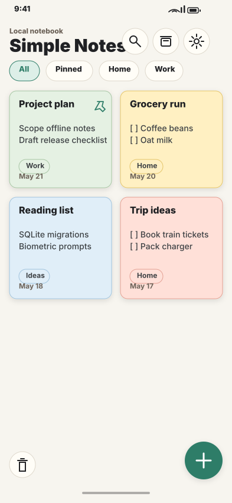
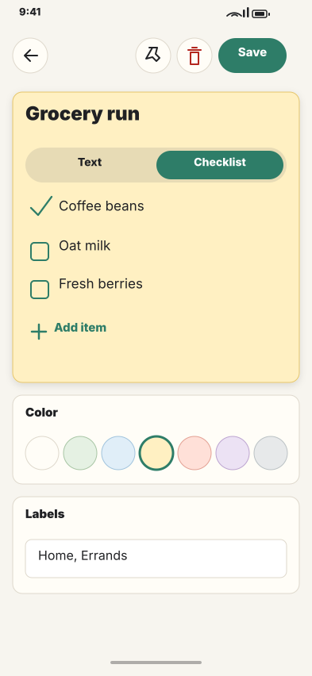
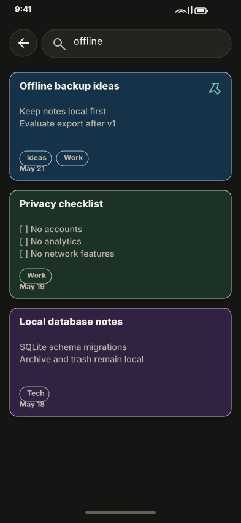
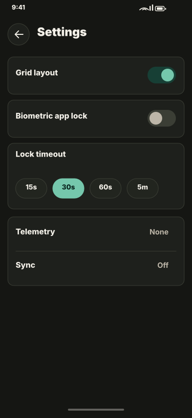

# Simple Notes

Simple Notes is an offline-first Expo React Native notes app for Android. It stores notes locally in SQLite, supports text notes and checklist notes, and does not include sync, telemetry, analytics, ads, accounts, remote config, or network-backed features.

## Screenshots

<p>
  
  
  
  
</p>

## Run

```bash
npm install
npm run android
```

The Expo scripts use `EXPO_NO_TELEMETRY=1` through `scripts/expo-no-telemetry.js`.

## CI

GitHub Actions runs on pushes and pull requests to `main`:

```bash
npm ci
npm run format:check
npm run lint
npm run typecheck
npm run test:ci
npm run audit
```

## Quality

```bash
npm run lint
npm run typecheck
npm run test:ci
npm run format:check
npm run format:write
npm run audit
```

## App Scope

- Local SQLite persistence with schema migrations.
- Text notes, checklist notes, colors, labels, pinning, archive, trash, search, and grid/list layout.
- Optional biometric app lock through Android strong biometrics where available.
- No backup, import, export, reminders, media attachments, cloud sync, or telemetry in v1.

## GitHub Push Checklist

```bash
git add .
git commit -m "Initial Simple Notes app"
git branch -M main
git remote add origin <your-repo-url>
git push -u origin main
```
